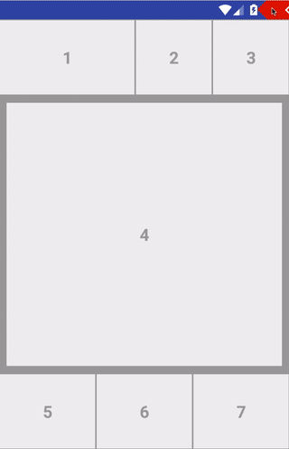
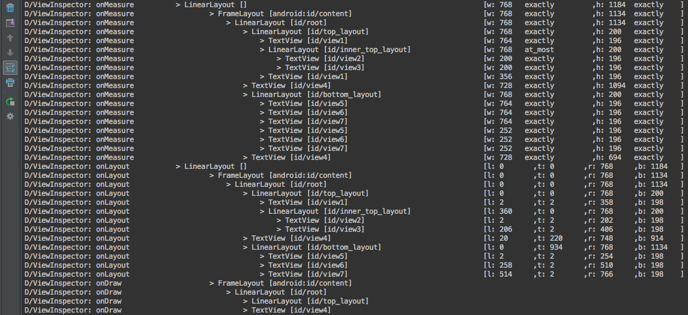

View Inspector Plugin
=====================

[  ](https://bintray.com/xfumihiro/maven/ViewInspector/_latestVersion)

View inspection toolbar for android development.



Features
--------

- Boundary
  - show outlines
  - show margins
  - show paddings

- Layer
  - [Scalpel](https://github.com/JakeWharton/scalpel) features

- Event
  - [Probe](https://github.com/lucasr/probe) features
  - Profile View Tree

- Logging
  - show view life-cycle events in logcat


- Absolute ZERO effects on non-debug builds

Usage
-----

```groovy
buildscript {
  repositories {
    jcenter() // or mavenCentral()
  }

  dependencies {
    classpath 'com.github.xfumihiro.view-inspector:view-inspector-plugin:0.2.0'
  }
}

apply plugin: 'com.android.application'
apply plugin: 'view-inspector'
```

To exclude packages:
```
viewInspector {
  excludePackages = ['android.widget.Space', 'com.squareup.leakcanary.internal']
}
```

[SNAPSHOTS][snap] of the development version. [[usage][snap_sample]]

Inspirations & Dependencies
---------------------------
[Scalpel](https://github.com/JakeWharton/scalpel) by Jake Wharton

[Probe](https://github.com/lucasr/probe) by Lucas Rocha

[this article](https://sriramramani.wordpress.com/2015/05/06/custom-viewgroups/) by
Sriram Ramani

Toolbar fashion : [Telecine](https://github.com/JakeWharton/Telecine) by Jake Wharton

Developed by
------------
Fumihiro Xue
 * [@xfumihiro](https://twitter.com/xfumihiro)
 * [+xfumihiro](https://plus.google.com/u/0/107636471060158273635)

License
-------

    Copyright 2015 Fumihiro Xue

    Licensed under the Apache License, Version 2.0 (the "License");
    you may not use this file except in compliance with the License.
    You may obtain a copy of the License at

       http://www.apache.org/licenses/LICENSE-2.0

    Unless required by applicable law or agreed to in writing, software
    distributed under the License is distributed on an "AS IS" BASIS,
    WITHOUT WARRANTIES OR CONDITIONS OF ANY KIND, either express or implied.
    See the License for the specific language governing permissions and
    limitations under the License.

[snap]: https://oss.sonatype.org/content/repositories/snapshots/com/github/xfumihiro/view-inspector/view-inspector-plugin/
[snap_sample]:https://github.com/xfumihiro/ViewInspector/blob/master/sample/build.gradle
